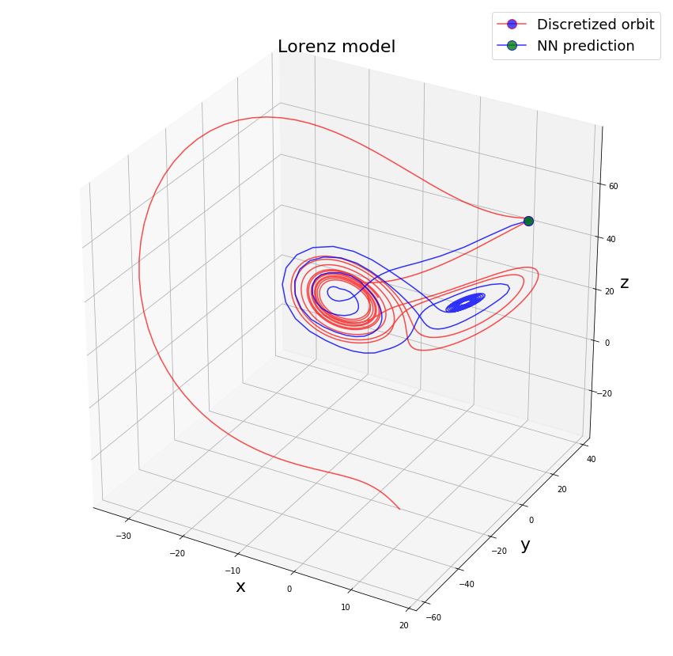

<!-- # --- -->
<!-- # title: "Rafael Monteiro's Website" -->
<!-- # --- -->
#
#

 I will post here  some tests and simulations that I've been doing, with an ultimate goal of sharing some ideas and codes on Dynamic Mode Decomposition and related things. They came in most cases from a reading group that we have been carring on during this semester in the group [Mathematical for Advanced Materials - Open Innovation Lab](https://unit.aist.go.jp/matham-oil/groups_en.htm), which I'm part of. I'm posting here just the parts that I presented or coded.
 
 A few remarks before we start:

- I don't claim originality for the results posted here: these are mostly some quick experiments I did while doing research. 
- Most of the notes is based on the book  [Data-Driven Science and Engineering: Machine Learning, Dynamical Systems, and Control](https://www.cambridge.org/core/books/datadriven-science-and-engineering/77D52B171B60A496EAFE4DB662ADC36E), by Steven L. Brunton and J. Nathan Kutz.

## Some notes and codes

- [A simple application of Singular Value Decomposition](SVD/example_svd.html) ([jupyter notebook version](SVD/example_svd.ipynb))([pdf version](SVD/example_svd.pdf))

In chapter 6, there is this interesting example of an approximation of a dynamical system by a Neural Network. 

{#id .class width=30 height=20px}

- [Approximating the Lorenz Model dynamics using a Neural Network](NN_Lorenz-Keras/NN_Lorenz-Keras.html) ([jupyter notebook version](NN_Lorenz-Keras/NN_Lorenz-Keras.ipynb))([pdf version](NN_Lorenz-Keras/NN_Lorenz-Keras.pdf))  

